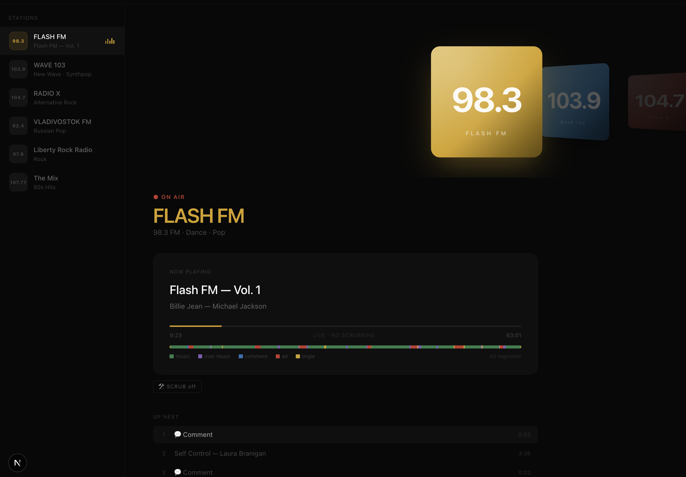
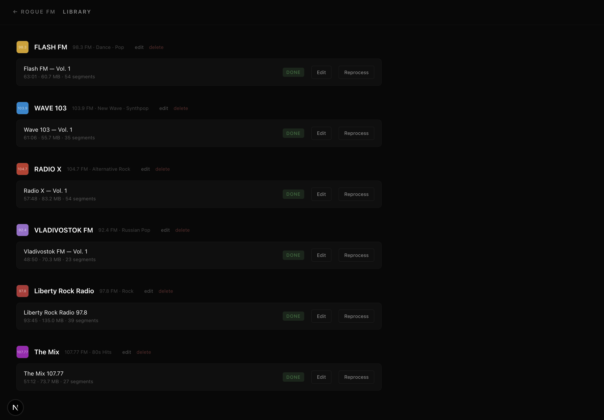
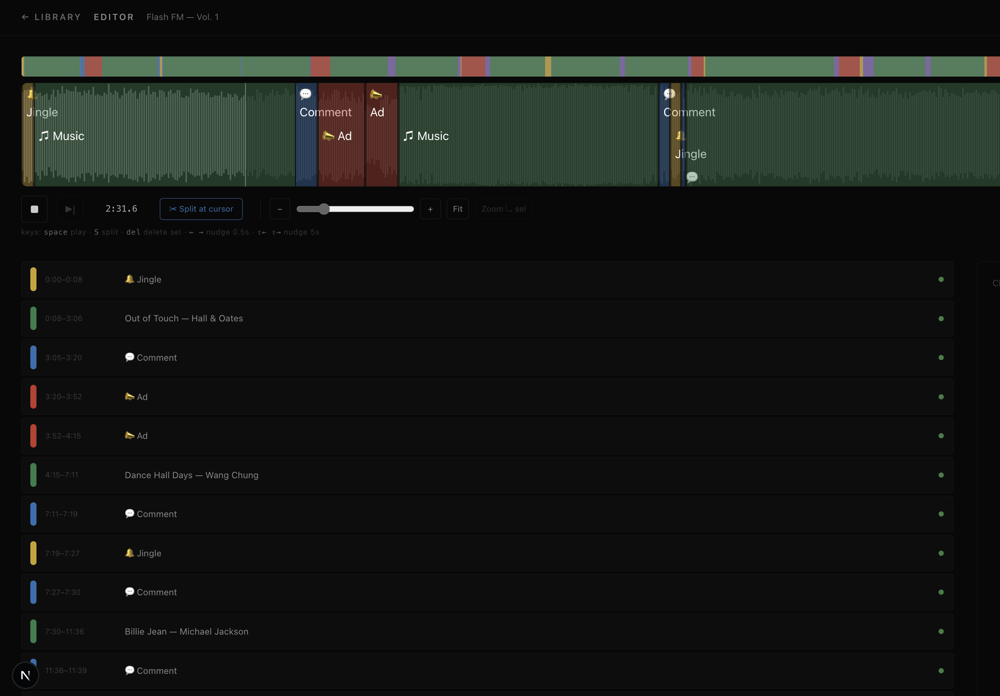

# Rogue FM

Personal radio broadcast simulator. Drop your hour-long radio rips in, let
the app dissect them into music / talk / ad / jingle segments, and play them
back as a live broadcast — tune to a station and you land in the middle of
whatever is on right now. Time keeps moving even when nothing is playing.

Built for one user, one machine, powered by local files.
No streaming, no sharing, no accounts.

## Concept

The unit is **not a track**, it's a **recording** — a continuous chunk of
radio (typically ~1 hour, often a YouTube rip of a real broadcast). Each
recording gets sliced into segments (music / DJ comment / ad / jingle /
talk-over / unknown) and those segments drive the skip logic and the
listings.

## Stack

| What                                                           | For                    |
| -------------------------------------------------------------- | ---------------------- |
| Next.js 16 + React 19 + TypeScript + Tailwind                  | UI and HTTP            |
| Prisma 7 + SQLite                                              | persistence (`dev.db`) |
| Howler.js                                                      | playback               |
| wavesurfer.js v7                                               | waveform editor        |
| Python — `inaSpeechSegmenter`, `librosa`, `sklearn` (via `uv`) | segmentation sidecar   |

Client ticks the broadcast clock and drives Howler; server spawns the
Python child on upload and stores the segments it writes back.

## Setup

Requirements:

- Node 22.x.
- Python 3.11.
- `ffmpeg` on PATH (inaSpeechSegmenter decodes via it).
- [`uv`](https://github.com/astral-sh/uv) for the Python subproject.

```bash
git clone <this repo>
cd rogue-fm

# Node side
nvm use 22
npm install
npx prisma migrate dev
brew install ffmpeg

# Python side
cd ml
uv sync                    # installs librosa + ina + sklearn + torch
cd ..

# put at least one .mp3 in storage/recordings/, then seed
npm run db:seed

npm run dev
```

Open <http://localhost:3000>. The cover-flow shows your stations, the
sidebar lists them too. Click **Tap to tune in** to start audio (browsers
block autoplay until a user gesture).

## A tour

Four screens. Here's what each one is for.

**Player** (`/`) — where you actually listen. The cover-flow is the
station picker, the sidebar mirrors it, and the colored ribbon under the
progress bar gives you the shape of the next half-hour at a glance.
Comment-skip and ad-skip only kick in on recordings that have been
processed.



**Library** (`/library`) — the management room. Add or rename stations,
upload a logo, watch processing progress live, hit **Edit** to dive into
a recording.



**Editor** (`/editor/[station]/[recording]`) — the meat. Waveform with
colored regions per segment. Drag the edges, click a region to reclassify
it (Music / Comment / Ad / Jingle / Over music / TBD), name the track if
you recognise it. Split at the cursor, delete, trim the tail. Keyboard:
`space` play, `S` split, `Del` delete, `←/→` nudge half a second
(`Shift` × 10).



## Data model

```
Station    id, slug, name, freq, genre, color, logoPath?
Recording  id, slug, stationId, filename, duration, processingStatus, ...
Segment    id, recordingId, startSec, endSec,
           type ∈ {music, dj, ad, jingle, talkover, unknown},
           confidence, label, trackTitle/Artist/Album/Year, manuallyEdited
Settings   key/value (epoch lives here)
```

`Station.slug` is unique; `Recording.slug` is unique per station. Pretty
URLs like `/editor/flash-fm/vol-1` resolve through
`/api/lookup/[stationSlug]/[recordingSlug]`.

## What's next

The auto-classifier — `unknown → dj/ad/jingle/talkover`.
End-to-end plumbing is already in place. Training on hand picked segments is missing.
A couple hundred labels on one station so far. A few more stations and the model will have something concrete to learn from.

## (Currently) Out of scope

- Network streaming or playback of remote sources. Local files only.
- Sharing, multi-user, collaboration.
- External metadata enrichment / track recognition (Shazam-style).
- iOS native (a native SwiftUI port is a separate experiment).

## Repo layout

```
app/                Next.js App Router
  api/              HTTP layer — recordings, segments, stations, audio, logo
  editor/[s]/[r]/   waveform editor page
  library/          management screen
  page.tsx          main player
components/         UI: Sidebar, CoverFlow, NowPlaying, UpNext, ...
lib/                pure logic: broadcastClock, player, skipLogic, slug, db
ml/                 Python subproject — process.py + uv venv
prisma/             schema, migrations, seed
scripts/            one-off node scripts (backfill-slugs, etc.)
storage/            local mp3s + logos (gitignored)
```

## Credits

UI prototyped with [Claude](https://claude.ai) — the cover-flow, segment
ribbon and dark theme were Claude sketches before they got wired up to
real data.

## License

Personal project. Use, fork, self-host — at your discretion.
The repo does NOT ship any audio.
